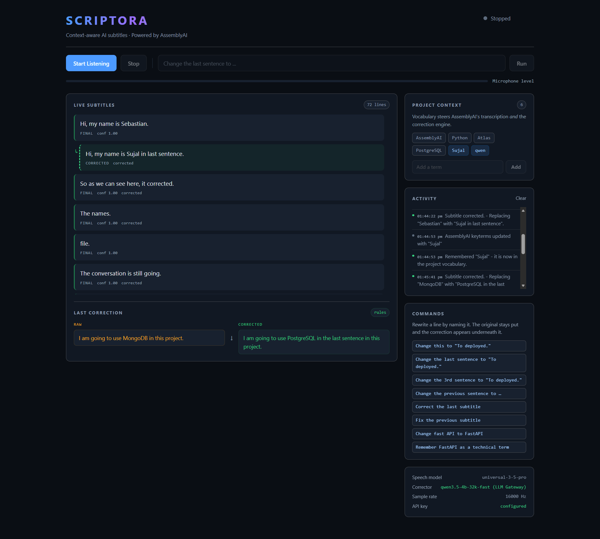

# SCRIPTORA

**Context-aware realtime subtitles you can correct and teach by voice.**

- **Live Demo:** https://scriptora.sjsujalgupta.xyz/
- **GitHub:** https://github.com/sjsujalgupta-sudo/scriptora-ai

**Built with:** AssemblyAI Realtime STT · FastAPI · Qwen LLM Gateway



---

## Live Demo

https://scriptora.sjsujalgupta.xyz/

Open the demo in a browser that allows microphone access, press **Start Listening**,
and talk. Realtime partial subtitles update as you speak and settle into final
lines when you pause. Each final line stays in the transcript, with the original
you actually said kept next to any corrected version, so a correction never hides
what the recogniser heard.

You can then fix or teach things **by voice, without touching the keyboard**:
say something like "Change Kubernetes to Kubernete" (an explicit replacement),
"Fix the last line", or "Add Kubernete to the vocabulary" — the transcript updates
in place, the original is preserved, and a new project term is pushed to the live
recogniser so it becomes more likely to *hear* your terminology the way you say it
in the sentences that follow, within the same session.

Scriptora can also interpret less structured repairs, such as "No, I said
twenty" or "I meant Symphony", by asking the LLM whether the turn is really a
correction. That interpretation is deliberately conservative: model-derived
instructions are validated against the known transcript before they are allowed to
change anything, and when the wording is ambiguous or the model is not confident
enough, **the turn simply stays in the transcript as ordinary speech**.

Not every ASR error needs a correction, and not every mistake will be caught
automatically — this is a live demo, not a claim of perfect transcription.

## Why this exists

Speech-to-text is good at words, but it has no idea what *your* project calls
things. It will happily normalise `Kubernete` to `Kubernetes` because that is a
word it already knows, and it will not learn that you meant otherwise. Scriptora
adds the part that is missing: a project vocabulary you build by speaking, and a
spoken interface for fixing lines — both scoped to the current session.

## What does the work

| Layer | Responsibility |
|---|---|
| **AssemblyAI Realtime STT** (`universal-3-5-pro`) | Does the speech recognition: streaming partials, turn detection, final transcripts, and `keyterms_prompt` for project vocabulary. |
| **Scriptora** (FastAPI + browser client) | Session state, the transcript, project context, command and intent handling, the correction workflow, and what is shown to the user. |
| **Qwen** (via the AssemblyAI LLM Gateway) | LLM-assisted *inference* for correction and for deciding whether a loosely-worded turn is a repair. It is **not** the speech model. |

An explicit edit — "change X to Y", "fix this line", "remember this term" — is
handled by a **deterministic fast path** and is applied without calling a model.
The LLM is only consulted when it could change the outcome (inference-based
corrections, or interpreting a natural repair), and its answer is adopted only if
it parses, validates against the known subtitles, and is actually different.
Otherwise the deterministic result stands and the result is labelled accordingly,
so the UI never claims the model did work the rules did.

## Commands and corrections (high level)

Scriptora does **not** require you to learn a command language, but it also does
**not** claim to understand everything you say. When a finalised turn could be an
instruction, it goes through a two-stage gate:

1. **Stage A — deterministic fast path.** Explicit, well-formed phrasings
   ("change X to Y", "fix this", "remember X", "replace X with Y") are parsed and
   executed directly. This is the common case, and it is instant.
2. **Stage B — natural repair interpretation.** If the turn is *not* an explicit
   command but carries repair wording ("No, I said …", "I meant …", "actually …"),
   Scriptora asks the LLM whether it is really a correction of something already
   in the transcript. The interpreter is consulted only when a cheap discourse
   marker is present, so ordinary dictation is never sent to the model.

Either way, **execution and validation stay deterministic**: a model-derived
instruction must reference a subtitle that actually exists, and the result is
always validated and applied through the same correction pipeline as an explicit
command. A recognised command is removed from the transcript with an explicit
event rather than appearing as a spoken line.

## Features

| | |
|---|---|
| **Live subtitles** | Streaming partial and final turns from AssemblyAI realtime STT. |
| **Voice corrections** | Explicit edits handled deterministically; natural repairs interpreted best-effort through the LLM. |
| **Honest attribution** | A result is labelled `rules` or `llm`, so the UI never misattributes who changed a line. |
| **Project vocabulary** | Remembered terms are pushed to the live AssemblyAI session (`keyterms_prompt`) mid-session, best-effort. |
| **Originals preserved** | Corrections are applied as a new line beside the original; before/after is always visible. |
| **Honest reporting** | If nothing needed fixing — or if a correction was not confident enough to apply — it says so. |
| **Clean shutdown** | Pressing Stop flushes any in-flight audio so the final spoken sentence is not lost. |

## How it works

```
mic ──▶ ScriptProcessorNode ──▶ 16 kHz mono s16le ──▶ 100 ms frames (3200 B)
                                                      │
                                            WebSocket (binary)
                                                      ▼
                                          FastAPI  /ws/audio
                                                      │
                                       per-connection ScriptoraSession
                                                      ▼
                             AssemblyAI Realtime v3  (universal-3-5-pro)
                                           │              │
                         final turn ───────┘              └──── keyterms_prompt
                                           ▼                              ▲
                         could this be an instruction?                     │
                              │                        "Remember X ..." ───┘
                     ┌────────┴────────┐
                     ▼                 ▼
             deterministic fast path   LLM interpretation / correction
                     │                 (validate against the transcript)
                     └────────┬────────┘
                              ▼
                    corrected subtitle + event stream ──▶ browser
```

- **Rules first, and they win ties.** A deterministic corrector always produces a
  safe result. LLM output is adopted only when it parses, validates against the
  known subtitle IDs, and differs from the original.
- **A literal edit never calls the model.** "Change X to Y" is already exact in
  the deterministic path, so the gateway is skipped entirely.
- **The model is consulted off the event loop.** LLM work uses `httpx.AsyncClient`,
  so a slow or unreachable gateway suspends only the pending correction; audio
  keeps streaming, and a gateway failure falls back to the deterministic result.
- **Vocabulary is pushed to the live recogniser session.** Remembering a term calls
  `set_params` on the *live* AssemblyAI session, so the next sentence is more
  likely to be transcribed with the term present. This nudges the recogniser; it
  does not guarantee any particular future transcription.
- **Credentials never reach the browser.** The key is read from the environment or
  a git-ignored `.env`; `/api/health` only reports whether one is configured.

## Quick start

Requires **Python 3.11+** (developed and tested on 3.12).

```bash
git clone https://github.com/sjsujalgupta-sudo/scriptora-ai.git
cd scriptora-ai

python -m venv .venv
.venv\Scripts\activate          # Windows
source .venv/bin/activate       # macOS / Linux

pip install -e ".[dev]"
```

Copy `.env.example` to `.env` and set your key (see [AssemblyAI dashboard](https://dashboard.assemblyai.com)):

```bash
copy .env.example .env          # Windows PowerShell
cp .env.example .env            # macOS / Linux
# then add your ASSEMBLYAI_API_KEY to .env
```

Run it:

```bash
python -m scriptora.main
# or, once installed:  scriptora
```

Open <http://127.0.0.1:8000>, press **Start Listening**, allow microphone access,
and talk. `ASSEMBLYAI_API_KEY` is required; everything else is optional.

### Configuration

All values are read from the environment or a `.env` file (git-ignored).
Only `ASSEMBLYAI_API_KEY` is required; it is used for both the realtime STT and
the LLM Gateway.

| Variable | Default | Purpose |
|---|---|---|
| `ASSEMBLYAI_API_KEY` | — | **Required.** AssemblyAI key: realtime STT + LLM Gateway. |
| `SCRIPTORA_HOST` | `127.0.0.1` | Bind address. |
| `SCRIPTORA_PORT` | `8000` | Port. |
| `SCRIPTORA_SPEECH_MODEL` | `universal-3-5-pro` | AssemblyAI realtime speech model. |
| `SCRIPTORA_STREAM_MODE` | `balanced` | `min_latency` / `balanced` / `max_accuracy`. |
| `SCRIPTORA_CORRECTOR_BACKEND` | `auto` | `auto`, `llm`, or `rules` (`rules` never calls the gateway). |
| `SCRIPTORA_LLM_MODEL` | `qwen3.5-4b-32k-fast` | Model behind the LLM Gateway. |
| `SCRIPTORA_FRAME_DURATION_MS` | `100` | Audio frame size sent to AssemblyAI (clamped to 50–1000 ms). |
| `SCRIPTORA_INTENT_CONFIDENCE` | `0.6` | Minimum interpreter confidence to treat a turn as a repair. |

The key is never sent to the browser, never logged, and never included in any
event payload.

## Development

```bash
pytest                 # 441 tests, no network access
ruff check .
ruff format --check .
```

The test suite runs offline — it never calls AssemblyAI or the LLM Gateway.
That includes a deterministic model of the browser shutdown path, so the
"final audio is not lost on Stop" behaviour is covered without a browser or a
microphone. Live behaviour was verified separately against the real services; see
[`docs/architecture.md`](docs/architecture.md) and
[`docs/demo.md`](docs/demo.md).

## Tech stack

Python 3.11+ · FastAPI · Uvicorn · AssemblyAI Realtime v3 (`universal-3-5-pro`) ·
Qwen via the AssemblyAI LLM Gateway · Pydantic v2 · Jinja2 · vanilla JS +
ScriptProcessorNode · binary WebSocket frames

## Deployment

The public demo is deployed on **Render** and served at
**https://scriptora.sjsujalgupta.xyz/**. It runs the same FastAPI app described
above; the only infrastructure requirement is `ASSEMBLYAI_API_KEY` in the host's
environment (never in the repository).

## Limitations

- **Session-scoped, in-memory state.** The transcript and project vocabulary live
  in memory for the current session. They are **not** persisted across restarts
  or across sessions.
- **Vocabulary is a hint, not a guarantee.** A remembered term is pushed to the
  recogniser's `keyterms_prompt`, which makes hearing your terminology more
  likely; it does not guarantee any specific future transcription.
- **LLM correction and interpretation are best-effort.** The interpreter can be
  wrong or ambiguous; below its confidence threshold a turn is left in the
  transcript rather than risking a wrong edit. Not every ASR error needs a
  correction, and Scriptora does not attempt to "fix" everything.
- **Correction is not magic for context the model cannot see.** The model only
  reasons over the current transcript and project context.
- **This public demo is intended for hackathon use, not production-scale
  multi-user deployment.**

## License

[MIT](LICENSE) © 2026 Scriptora contributors
